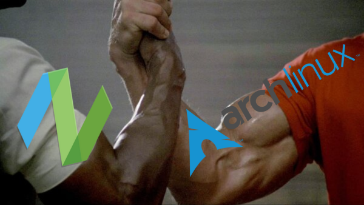

# Dev environment setup

This is my personal environment setup for **Arch Linux**, btw.
Using Wayland with Hyprland and **NeoVim** ofc.


<p align="center">

</p>

## Usage

This repo should be located as such: `$HOME/personal/dev`.
```
mkdir -p ~/personal
cd ~/personal
```

Download this repo over to `~/personal/dev`.

To run the main scripts located in the root directory of this repo, prefix them with assigning `$DEV_ENV` system variable.
This can be done with this command **while in the root of this repository** (`~/personal/dev`):
```
DEV_ENV=$(pwd) ./<script>
```
*Replace <script> with `dev-env`, `run`, or `init`.*
You can also run `dev-env` and `run` with a `--dry` flag at the end of the command to see what's going to happen.

### Sound
You can use `pavucontrol` for sound management. I'm also using script `audiofix` located in
`env/.local/scripts/audiofix` (in this repo).
It is being run from the bottom of `.zsh_profile` which you can find in `env/`.

### Wallpapers
This setup is using `hyprpaper` for handling wallpapers. Check out the `env/.config/hypr/hyprpaper.conf` 
config to make sure you have set proper wallpaper paths or none. You can also switch wallpapers
very easily using `setbg` command, which is located in `env/.local/scripts/setbg`.
It opens a `fzf` menu where you can select wallpaper from `$HOME/personal/wallpapers/` directory.

### Greeter SDDM
If you are using SDDM as your greeter, you may also want to make it nice looking.
I can recommend [this SilentSDDM theme](https://github.com/uiriansan/SilentSDDM).

### Credit
Inspired by ThePrimeagen's [dev](https://github.com/ThePrimeagen/dev)
